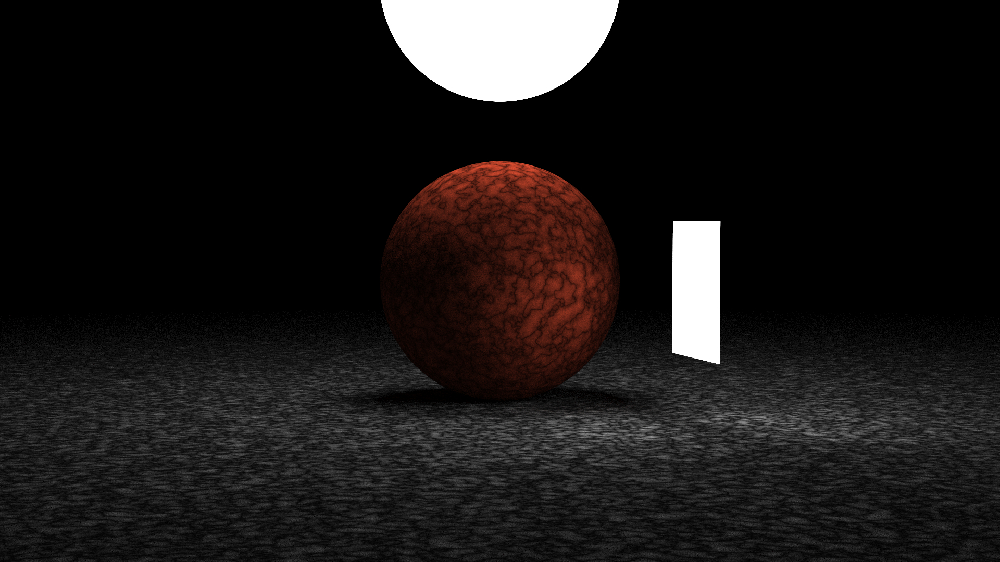

# OneWeekendRaytracer
A simple raytracer, implemented in Rust, based on 'Ray Tracing in One Weekend'.

## Features
- Physically-based rendering
- Pixels are rendered in parallel using [rayon](https://docs.rs/rayon)
- Multiple materials: Lambertian, Metal, Dielectric (glass), Emissive, Volumetric (smoke)
- Noise textures & image based textures
- BVH to optimize ray interactions
- Customizable camera settings
- Gamma correction

## Source
- Made while following [Ray Tracing in One Weekend Book Series](https://github.com/RayTracing/raytracing.github.io).
- This project implements the first two books, and I may eventually return to implement the third book.

## Renders
### Book 1 Final Scene

### Book 2 Final Scene

### Lighting Demo

### Cornell Box

### Cornell Smoke

